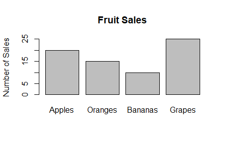
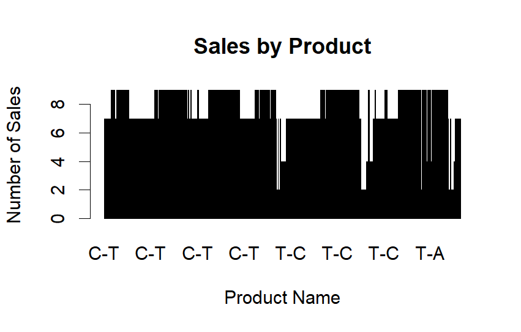

# Using AI to aid coding

## Introduction

OpenAI can be a helpful tool for learning coding in R in a few ways:

Access to vast amounts of information: OpenAI can provide access to a vast amount of information on coding in R. You can use OpenAI to search for tutorials, videos, and other resources that can help you learn R coding.

Interactive learning: OpenAI can provide an interactive learning experience through its GPT-3-based models. You can ask OpenAI questions about R coding and it will provide you with answers in natural language. This can be a helpful way to learn R coding, especially if you are a beginner.

Code completion: OpenAI can provide code completion suggestions that can help you write code faster and more accurately. For example, if you start typing a function in R, OpenAI can suggest the rest of the code based on what you have typed so far.

Language translation: OpenAI can also be used to translate R code from one language to another. This can be helpful if you are working with R code written in a different language or if you need to translate R code for a project.

Overall, OpenAI can be a powerful tool for learning coding in R, providing access to information, interactive learning, code completion, and language translation. However, it is important to note that OpenAI is just one tool and should be used in combination with other resources, such as books, online tutorials, and coding communities.

### Learning Objectives

- Reproduce a barplot in RStudio from existing data.
- Understand the uses and limitations of artificial inteligence chatbots.

## Start

### Can we make a barplot in R using AI to generate the code

using [openai](https://chat.openai.com/chat)

we ask it `write a script in R plot a bargraph`.

we then get the following code

```
# Create sample data
x <- c("Apples", "Oranges", "Bananas", "Grapes")
y <- c(20, 15, 10, 25)

# Plot the bar graph
barplot(y, names.arg = x, main = "Fruit Sales", ylab = "Number of Sales")
```
and the follwing explaination:

```
Let me explain the code line by line:

We create a vector x containing the names of fruits, and a vector y containing the number of sales for each fruit.
The barplot() function is used to create the bar graph. The first argument y is the height of the bars. The names.arg argument is used to label each bar with the corresponding fruit name. The main argument specifies the main title of the graph, and the ylab argument specifies the label for the y-axis.
When you run this code, you should see a bar graph with four bars, labeled "Apples", "Oranges", "Bananas", and "Grapes". The height of each bar corresponds to the number of sales for the corresponding fruit.

```
The code produces the following 




This is OK, but lets say we have our own data we wish to plot.

we could ask the AI:

`write a script in R to plot a barplot from existing data`

and get the following:

```
# Load the data
data <- read.csv("sales_data.csv")

# Plot the barplot
barplot(data$Sales, names.arg = data$Product, 
        main = "Sales by Product", ylab = "Number of Sales", xlab = "Product Name")
```


With the explaination:

```
Here's what each line of the code does:

We load the data from a CSV file named "sales_data.csv" into a data frame named data. You'll need to replace "sales_data.csv" with the name of your own file, or the  file path if it's in a different directory.

We use the barplot() function to create a barplot of the sales data. The first argument data$Sales specifies the height of each bar, which we're pulling from the "Sales" column of our data frame. The names.arg argument is used to label each bar with the corresponding product name, which we're pulling from the "Product" column of our data frame. The main argument specifies the main title of the graph, and the ylab and xlab arguments specify the labels for the y-axis and x-axis, respectively.

When you run this code, you should see a barplot of the sales data, with each bar labeled with the corresponding product name. The height of each bar corresponds to the sales value for the corresponding product.

```

We will of course, have to change the code to make the script work with our existing data `single-filtered.csv` and the different column names the data has.

The code then becomes:

```

# Load the data
#data <- read.csv("sales_data.csv")
data <- read.csv("single-filtered.csv")

# Plot the barplot
# barplot(data$Sales, names.arg = data$Product, 
#         main = "Sales by Product", ylab = "Number of Sales", xlab = "Product Name")
barplot(data$strain, names.arg = data$snp_type, 
        main = "Sales by Product", ylab = "Number of Sales", xlab = "Product Name")


```

which produces a plot like this:



## ggplot

```

library(ggplot2)

# Create the barplot using ggplot2
p1 <- ggplot(data, aes(x=strain, y=snp_type)) +
  geom_bar(stat="identity", fill="blue") +
  xlab("Category") +
  ylab("Count") +
  ggtitle("My Barplot")
  
```  


